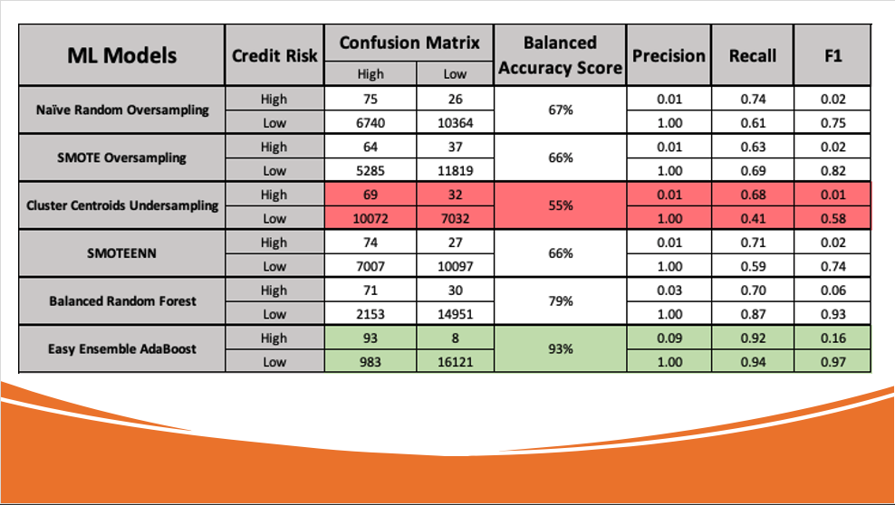

# Credit_Risk_Analysis

*****
*****

* By: Tyler Sojka
* January 2020
* Supervised Machine Learning and Credit Risk: Using machine learning models to predict credit risk.
  
*****
*****

## Tools

* Pandas
  * In computer programming, pandas is a software library written for the Python programming language for data manipulation and analysis. In particular, it offers data structures and operations for manipulating numerical tables and time series.
* NumPy
  * NumPy is a library for the Python programming language, adding support for large, multi-dimensional arrays and matrices, along with a large collection of high-level mathematical functions to operate on these arrays.
* scikit-learn
  * is a free software machine learning library for the Python programming language. It features various classification, regression and clustering algorithms including support vector machines, random forests, gradient boosting, k-means and DBSCAN, and is designed to interoperate with the Python numerical and scientific libraries NumPy and SciPy.
 * imbalanced-learn
   *  imbalanced-learn is a python package offering a number of re-sampling techniques commonly used in datasets showing strong between-class imbalance
       * RandomOverSampler
         * Class to perform random over-sampling.
       * SMOTE
         * SMOTE synthesizes new examples for the minority class.
       * ClusterCentroids
         * Undersample by generating centroids based on clustering methods.
       * SMOTEENN
         * Combine over- and under-sampling using SMOTE and Edited Nearest Neighbours.
       * BalancedRandomForestClassifier
          * A balanced random forest classifier. A balanced random forest randomly under-samples each boostrap sample to balance it.
        * EasyEnsembleClassifier
          * Bag of balanced boosted learners also known as EasyEnsemble. This algorithm is known as EasyEnsemble. The classifier is an ensemble of AdaBoost learners trained on different balanced boostrap samples. The balancing is achieved by random under-sampling.

## Overview
Credit risk is an inherently unbalanced classification problem, as good loans easily outnumber risky loans. Therefore, we’ll need to employ different techniques to train and evaluate models with unbalanced classes.

Using the credit card credit dataset from LendingClub, a peer-to-peer lending services company, we will oversample the data using the RandomOverSampler and SMOTE algorithms, and undersample the data using the ClusterCentroids algorithm. Then, we will use a combinatorial approach of over- and undersampling using the SMOTEENN algorithm

Next, we will compare two machine learning models that reduce bias, BalancedRandomForestClassifier and EasyEnsembleClassifier, to predict credit risk.

## Results

Note: The first 4 models are sampling techniques, that were used to preprocess the data for logistic regression.

### Definitions

TP = True Positives

TN = True Negatives

FP = False Positives

FN = False Negatives

* <b>Accuracy </b> 
  * Accuracy is the ratio of correctly predicted observations to the total number of observations.
  
    Accuracy alone doesn't tell the full story when you're working with a class-imbalanced data set, like this one, where there is a significant disparity between the number of positive and negative labels.

 Accuracy = (TP+TN) / TP + TN + FP + FN 

* <b>Precision</b>
  * Precision is obtained by dividing the number of true positives (TP) by the number of all positives (i.e., the sum of true positives and false positives, or TP + FP).
  
    In machine learning, precision is a measure of how reliable a positive classification is. "I know that the test for cancer came back positive. How likely is it that I have cancer?"

 
 Precision = TP/(TP + FP) 

* <b>Recall / Sensitivity</b> 
  * Another way to assess a model's performance is with sensitivity, also called recall. While the term recall is more commonly used in machine learning, the two terms are synonymous and will be used interchangeably from this point.
  
    Sensitivity is a measure of how many people who actually have cancer were correctly diagnosed.
    "I know that I have cancer. A model that produces no false negatives has a recall of 1.0. How likely is it that the test will diagnose it?" Here is the formula for sensitivity:

Sensitivity = TP/(TP + FN)

High sensitivity means that among people who actually have cancer, most of them will be diagnosed correctly. High precision, on the other hand, means that if the test comes back positive, there's a high likelihood that the patient has cancer.

Highly sensitive tests and algorithms tend to be aggressive, as they do a good job of detecting the intended targets, but also risk resulting in a number of false positives. High precision, on the other hand, is usually the result of a conservative process, so that predicted positives are likely true positives; but a number of other true positives may not be predicted.

* <b>F1 score</b>
    * Also called the harmonic mean, can be characterized as a single summary statistic of precision and sensitivity. A useful way to think about the F1 score is that a pronounced imbalance between sensitivity and precision will yield a low F1 score. The formula for the F1 score is the following:

F1 = 2(Precision * Sensitivity)/(Precision + Sensitivity)

## Summary

From the table summarizing all of the machine learning models, and sampling techniques, using cluster centroid undersampling combined with logistic regression, yielded the worst results. The easy ensemble AdaBoost model on the other hand preformed quite favorably. While it had a low precision, the recall was .92. While the model may predict a number of false positives, ie, high risk applications that were actually low risk, this is cheaper for a bank to deal with than false negatives, where the application is predicted low risk when it is actually high risk. 

If one of these models were to be my recommendation, it would be Easy Ensemble AdaBoost. 